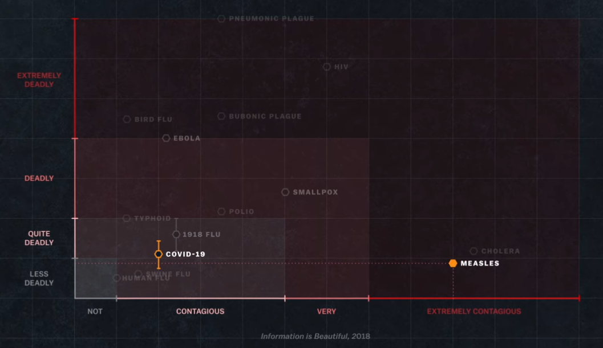

```{r setup, include=FALSE}
knitr::opts_chunk$set(echo = TRUE)#con esto se depliegan los teoremas

```

# Introducción

Existen diferentes puntos de vista para estudiar la actual pandemia que tratan de responder a diferente preguntas, ¿qué es este virus?, ¿de dónde viene el virus?, ¿cómo se contagia?, ¿cualés son los sintomas?, ¿qué medidas de prevención existen?, ¿cuáles son los mejores modelos para predecir contagios?, ¿qué datos son importates para las proyecciones?, ¿cuál es la mejor técnica para registrar datos?, ¿Cómo se pueden evitar contagios?, ¿Qué carácteristicas influyen para que un cierto tipo de individuos tenga más riesgo de contagio/muerte?, etc. 

El presente documento estudia modelos de predicción para casos confirmados en México mediante la herramienta de series de tiempo, no necesariente es el mejor enfoque pero considero que es una posible manera de modelar, pues los datos (número de contagios, muertes, etc) siguen un orden temporal y dado que los resultados no se conocen por anticipado pueden verse como variables aleatorias, precisando, los datos medidos representan una realización de un proceso estocástico en la variable reportada.

No se prentenden agotar todas las preguntas que pueden surgir al analizar los datos como series de tiempo ni que los resultados se tomen como base para recomendaciones de salud pública, la información se presenta para fines educativos. 

Existe bastante información sobre la pandemia que es actualizada día a día, así que tener en consideración todas las consecuencias de las actualizaciones es complicado. Por tal motivo se especificará la información consultada y el punto de vista abordado a partir de dicha consulta. 

Para una revisión de la información oficial por parte del gobierno de México, sobre la actual pandemia, se puede consultar la siguiente [página](https://coronavirus.gob.mx/), que considero completa tanto para información a la población, como información técnica, además de datos y visualizaciones. 


# CoVID-2019

Para tener un primer acercamiento en terminos generales a la actual pandemia, sin necesidad de un conocimiento especializado, recomiendo ver el documental de NETFLIX: Coronavirus, Explained. Comparto el trailer  (dicen que alguien lo colgo en la siguiente [dirección](https://gnula.se/capitulos/coronavirus-en-pocas-palabras/))

<iframe width="560" height="315" src="https://www.youtube.com/embed/sgZ7RKyDrLg" frameborder="0" allow="accelerometer; autoplay; encrypted-media; gyroscope; picture-in-picture" allowfullscreen></iframe>

<aside>
Existen bastantes fuentes de información que podrían utilizarse, esta me parece una forma amigable de cononocer un poco del tema
</aside>

A grandes rasgos:

> Tipo de virus: *Virus zoonótico* (salta de una animal a un humano)

> Nombre del Virus: *SARS-CoV-2*

> Enfermedad Causada: *CoVID-19* (CoronaVirus Disease 2019)

El prefijo _Corona_ es debido a su forma, no es el primer coronavirus conocido, en los últimos 20 años han existido varias familias como el MERS-CoV y el SARS-CoV. Al ser un nuevo virus zoonótico no existe vacuna, con lo conocido por otros virus se observa que de forma natural los individuos contagiados sobrevivientes desarrollan inmunidad. Si la cantidad de individuos es _grande_ esto se conoce como inmunidad colectiva. Bajo la actual situación habría millones de muertos a nivel mundial antes de alacanzar la inmunidad colectiva, por lo que se ha recurrido a establecer cuarentenas para contener los niveles de contagio.

Esta situación de pandemia, que no se había presentado con otros coronavirus, es porque *SARS-CoV-2* preseta _regularidad_ entre la letalidad y el grado de contagio, ver Figura \@ref(fig:letalidad); es decir, no mata a los individuos de forma inmediata, lo cual permite que la persona infectada contagie a más indivudos antes de siquiera saber que es portador. 

```{r, "letalidad", echo=FALSE,fig.cap="Figura presentada en Coronavorus, Explained", out.extra="class=external", layout="l-body-outset"}

```

> La información presentada es una breve introducción, para mayor infromación se puede consultar la [página](https://coronavirus.gob.mx/) del gobierno de México   


# Datos, modelos y consideraciones 

Existen varias consideraciones sobre qué y cómo modelar la pandemia, en la plática de Rafael Prieto Curiel [@flacsorafael], se exponen los siguientes puntos:

* México es uno de los principales países con casos confirmados, posiblemente por ser uno de los países más poblados es natural esta situación

* México es el país con el menor número de pruebas en Latinoamerica.

* Modelo SIR (Susceptibles-Infectados-Recuperados) es el modelo usual, donde a grandes rasgos habla sobre qué cantidad de individuos están dentro de cada clasificación y cómo éstos se mueven; es decir, un individuo susceptible pasa a ser infectado y un infectado pasa a recuperado. El modelo es hipersensible, lo cual implica que si se cambian _poco_ los parámetros utilizados en el modelo, estos proyectarían cantidades _muy distintas_ de individuos en cada clasificación.

* El número de casos confirmados es un reflejo del número de pruebas realizadas, el número de pruebas es un factor susceptible.

* Se recomendaría realizar las pruebas en forma aleatoria, para proyectar el número de infectados a la población. 

El objetivo de presentar esta información es mostrar que las proyecciones que se puedan tener bajo cualquier modelo estan sujetas al número de pruebas realizadas.  


Por otro lado, la recopilación de los datos presenta varios problemas, por ejemplo: la actualización de las bases de datos. Resulta que los datos (número de infectados, número de muertes, etc.) a la fecha, se siguen actualizando, lo que hace **complicado tomar decisiones de pólitica pública**, pues no se tiene toda la información, esto es comentado por Sebastian Garrido [@flacsosegasi]. 

Los formatos de los datos y los propios datos han cambiado, por lo cual obtener la información y depurar los datos es una tarea ardua, se obtienen datos de fuentes oficiales de información, así como de distintos sitios que ofrecen la información parcialmente depurada, cuando ha sido necesario los datos se han depurado de la fuente oficial. Cuando se haga uso de una fuente en específico se indicará la referencia correspondiente. 


De acuerdo a los estándares mundiales de vigilancia no se tiene la intención de capturar todos los casos, se quiere describir tendencias a lo largo del tiempo, para ello la vigilancia centinela recopila información nominal detallada de casos confirmados, esta se debe realizar en lugares estratégicamente seleccionados (representativos de la población), México tiene 475 unidades centinela [@flacsoricardo].

El modelo CENTINELA propone estimar los casos positivos de acuerdo a las mediciones elaboradas de casos confirmados. Algunos investigadores han tomado estos datos y han elaborado sus propias proyecciones, una de estas proyecciones, debida a Arturo Erdely [@flacsoerdely], establece una proyección de casos diarios máximos reportados para el 5 de junio de aproximadamente $2500$, pero al 30 de mayo la fecha oficial ya era de $2885$ en México. 

Por último y de forma independiente a los objetivos del documento se debe tener en cuenta que la comunicación de las noticias sobre la pandemia debe de hacerse con responsabilidad [@flacsomaria], pues si bien es un problema de salud pública, esta de por medio la interpretación de la población.

## Sobre los datos utilizados y las mediciones reportadas

Para fines de visualiación se trabaja con los datos reportados al 10 de junio de 2020, es decir, si existieron correcciones sobre los datos posteriores a esta fecha, estas no se tienen consideradas. 

Para fines de predicción se toma la base de datos de la fecha comentada anteriormente, de estos datos, se toma el $80\%$ para estimación. 

El  $60\%$ de las gráficas son interactivas, en el sentido que si se quieren conocer datos de éstas basta con colocar el apuntador sobre las gráficas para que se muestren los datos. Pueden ocultarse datos, mostrar otros, etc,. 


# ¿Qué se desarrolla? 


En la pestaña de Visualización se encuentran gráficas interactivas sobre la actual situación de la pandemia en México, se hacen algunos comentarios especto a las visualizaciones y se plantean algunas preguntas que podrían ser contestadas en un futuro. 

En la pestaña de Series de Tiempo, se indican algunos conceptos de series de tiempo  y estos conceptos se aplican a los casos confirmados en México al 10 de junio, el uso de herramientas de series de tiempo es motivado por el siguiente [artículo](https://arxiv.org/pdf/2004.07859.pdf)

Se estiman modelos **ARIMA**, algunos son descartados por no satisfacer estacionariedad, otros son comparados para decidir sobre ellos con la prueba de  Diebold-Mariano y otras mediciones de precisión.


